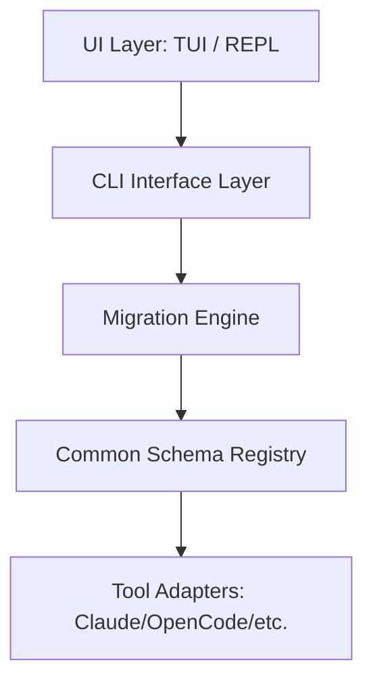

# AgentSync CLI

[](https://www.npmjs.com/package/@agent-sync/cli)
[](https://github.com/harsh7800/agentsync/actions)
[](LICENSE)

> **AI-assisted terminal environment for managing and migrating AI agent configurations**

AgentSync CLI is a professional workspace for migrating AI agent environments between Claude Code, Gemini CLI, Cursor, OpenCode, and GitHub Copilot CLI. It features a modern **Ink-based TUI**, an **interactive Agent Mode** (REPL), and an **automated CI/CD pipeline**.


## 🚀 Features

- 🤖 **Agent Mode** - Interactive REPL with slash commands (`/scan`, `/migrate`, `/status`, `/update`)
- 🎨 **Modern TUI** - A sleek, React-powered terminal interface using [Ink](https://github.com/vadimdemedes/ink)
- 🔄 **Migration Engine** - Bidirectional migration across 5+ AI tool ecosystems
- 🔍 **Smart Scanner** - Auto-detect installed AI tools and local agent configurations
- 🧠 **AI Mapping** - Intelligent schema translation for complex tool-to-tool migrations
- 🔐 **Security First** - Key masking, local backups, and dry-run safety by default
- ⚡ **CI/CD Pipeline** - Parallel build/type-check and zero-touch automated releases

## 📦 Installation

```bash
# Install globally via npm
npm install -g @agent-sync/cli

# Or run instantly with npx
npx @agent-sync/cli
```

## 🛠 Usage

### 1. Modern TUI (Recommended)
Launch the graphical terminal interface for a guided, visual experience:
```bash
agentsync tui
```

### 2. Agent Mode (REPL)
Run `agentsync` without arguments for an interactive slash-command interface:
```bash
$ agentsync
> /scan system
> /migrate --target opencode
```

### 3. Command Mode
Use traditional flags for automation or CI pipelines:
```bash
# Detect installed tools
agentsync detect

# Verify tool installation and identify issues
agentsync verify

# Sync changes since last scan
agentsync sync
```

## 📋 Slash Commands (Agent Mode)

| Command | Description | Shortcut |
|---------|-------------|----------|
| `/help` | Show available commands | `/h` |
| `/scan` | Scan for agents and tools | - |
| `/migrate` | Start interactive migration | - |
| `/status` | Show current session/discovery state | - |
| `/update` | Check for AgentSync CLI updates | `/u` |
| `/exit` | Exit Agent Mode | `/q` |

## ⚙️ Automated CI/CD Pipeline

AgentSync features a fully automated release pipeline powered by GitHub Actions:

- **Parallel Validation**: `Build` and `Type Check` jobs run in parallel for maximum speed.
- **Zero-Touch Releases**: Every merge to `main` automatically:
  - Bumps the version (Patch).
  - Generates a new Git Tag.
  - Creates a GitHub Release.
  - Publishes the new version to **npm**.
- **Monorepo Scaling**: The pipeline handles dependency resolution across all workspace packages automatically.

## 🏗 Architecture

AgentSync uses a decoupled, adapter-based architecture:



- **`@agent-sync/cli`**: The terminal interface and user interaction logic.
- **`@agent-sync/core`**: The core migration engine, parsers, and translators.
- **`@agent-sync/schemas`**: Canonical JSON schemas for cross-tool compatibility.

## 🧪 Development

This project uses a `pnpm` monorepo structure.

```bash
# Clone and install
git clone https://github.com/harsh7800/agentsync.git
pnpm install

# Parallel build all packages
pnpm build

# Run specific suite
pnpm --filter @agent-sync/cli test

# Run CLI in dev mode
pnpm --filter @agent-sync/cli dev
```

## 🛡 Security & Safety

- **Local First**: All migrations happen entirely on your machine.
- **Key Masking**: Sensitive tokens are never written to logs or screen.
- **Atomic Writes**: Migrations are all-or-nothing to prevent corrupted configs.
- **Backups**: Previous configurations are backed up in `.agentsync/backups/`.

## 📄 License

MIT License - see [LICENSE](LICENSE) file for details.

---

**Built with ❤️ for AI developers by AgentSync Team**
